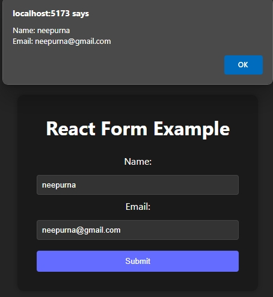

# Basic Form 

## Screenshot

## Student Information
- **Name:** Neepurna Baral
- **Student ID:** 101586698
- **Course:** Front End Development
- **Assignment:** 05

## Project Description
In this Lab we have successfully learned how to handle input events and create forms in React. With these skills, we can build interactive user interfaces and collect user data in your web applications. Feel free to customize and expand your forms based on your project requirements. 
Happy coding!

## Setup Instructions
1. Clone the repository
2. Run `npm install` to install dependencies
3. Use `npm run dev` to start the development server
4. Open browser and navigate to `http://localhost:5173`

